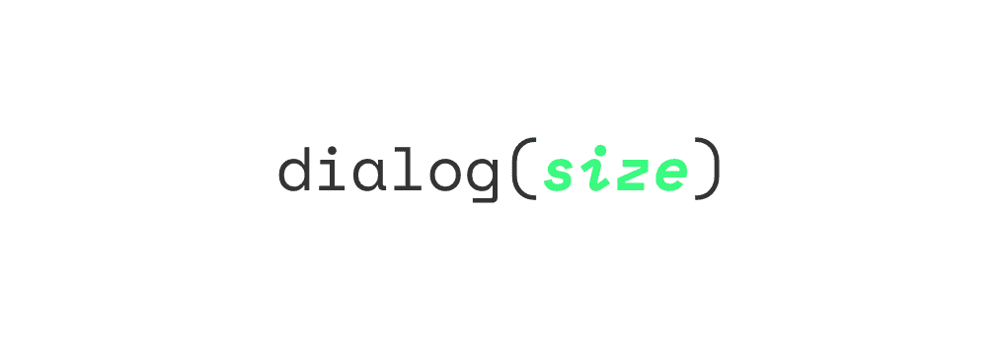

<p align="center">
    <a href=""></a>
</p>

# dialog(size)

A relative size-system that aims to ease the dialog between Design and Frontend by providing a system that is easily extendable and does not relay on names.

Play around with it in the [**demo**](http://sassmeister.com/gist/7e563730c9a2c15581e5c40a10098369)

## Installation

```
npm install dialog-sizes
```

## Basic usage

1. Inlcude `dialog-size.scss`
```scss
@include dialog-sizes;
```

2. Define a palette of possible sizes by setting the `$dialog-sizes`
```scss
$dialog-sizes:
    (0.2rem tiny) // size(-1)
    0.5rem
    (0.75rem small)
    0.8rem
    (1rem medium isBase) // size(0)
    1.2rem
    (1.5rem large)
    3.5rem
    5rem
    (10rem huge)
    20rem;  // size(1)
```

3. Call `size()` function
```scss
body {
    padding: size(-1); // => 0.2rem
    font-size: size(0); // => 1rem
}
h1 {
    font-size: size(1); // => 20rem
    padding: size(large) 0; // => 1.5rem
}
p {
    padding: size(3rem); // => 3.5rem
}
```

## Usage

Once done your $dialog-sizes is set up, the `size()` function can be used in different ways:

### Relative system

- `size(1)` will return the largest size in your system (20rem)
- `size(-1)` will return the smalest size in your system (0.2rem)
- `size(0)` will return the base size (1rem)
- `size(.2)` will snap to the closest value in your system

### Names

You can also refere to absolute points in your size system by using names:

- `size(large)` will return`

### Value

There is also the possibility to use a size in the same unit then your system. (In this case REM)

- `size(9rem)` will retrun 10rem since its the closest in your system
